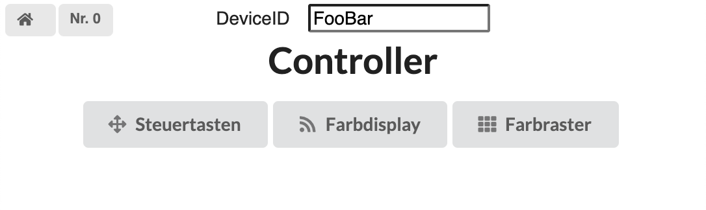
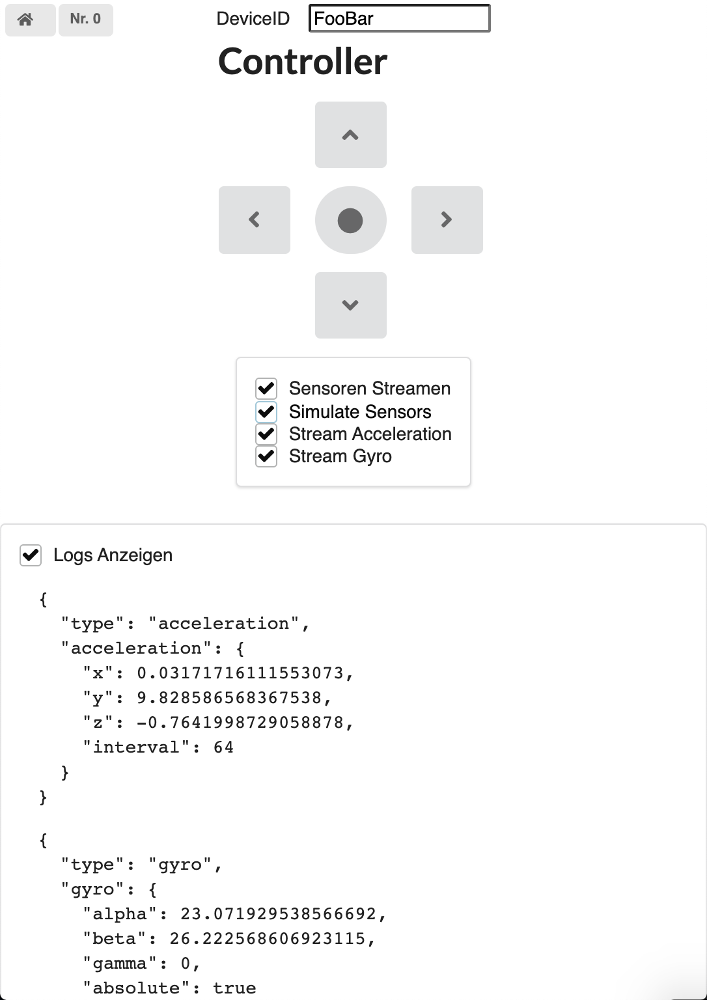
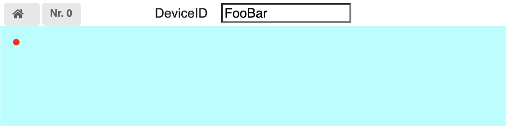
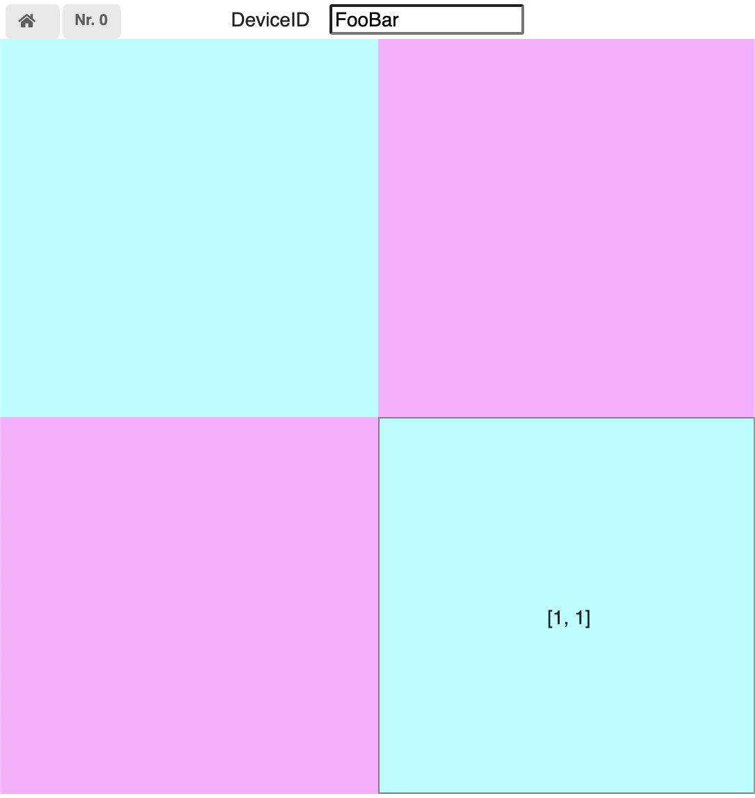

# Socket IO

Nutze dein Smartphone als Controller oder als Anzeigegrät. Benutzt [https://io.balthasarhofer.ch](https://io.balthasarhofer.ch) um Daten vom und ans Smartphone zu schicken.

Beispiel: Steuere ein Turtle im "Achtung die Kruve" Stil:


Um eine Verbindung zum Smartphone aufzubauen, muss das pip paket [smartphone-connector](https://pypi.org/project/smartphone-connector/) installiert und eingebunden werden:

```py
from smartphone_connector import Connector

#                          url socketio server       device id (auf dem Smartphone eintippen)
#                                   ↓                    ↓
connector = Connector('https://io.balthasarhofer.ch', 'FooBar')
```

Aktuell gibt es 4 verschiedene Screens mit unterschiedlichen Anzeigen und Controls auf dem Smartphone:

#### Home

Unter `Device ID` muss die im Python skript verwendete `device_id` eingegeben werden

#### Controller



Verschickt `new_data` Events an den socket.io Server und können über den smartphone-connector abgefangen werden
- Tastenklicks (`'up', 'right', 'down', 'left', 'home'`)
  - callback: `connector.on_key`
  - Format eines Datenpakets:
    ```py
    {
        'device_id': 'FooBar',
        'device_nr': 0,
        'time_stamp': 1596731613.793, # zeit seit 1.1.1970 in Sekunden
        'type': 'key',
        'key': 'up' | 'right' |'down' |'left' | 'home'
    }
    ```

- Acceleration (falls im Smartphone vorhanden, sonst kann das Event simuliert werden)
  - callback: `connector.on_acceleration`
  - Format eines Datenpakets:
    ```py
    {
        'device_id': 'FooBar',
        'device_nr': 0,
        'time_stamp': 1596731613.793,
        'type': 'acceleration',
        'x': 0.0,
        'y': 0.0,
        'z': -9.81,
        'interval': 32 # Zeitintervall (ms) zwischen Sensormessungen
    }
    ```
- Gyro (falls im Smartphone vorhanden, sonst kann das Event simuliert werden)
  - callback: `connector.on_gyro`
  - Format eines Datenpakets:
    ```py
    {
        'device_id': 'FooBar',
        'device_nr': 0,
        'time_stamp': 1596731613.793,
        'type': 'gyro',
        'alpha': 0.0,   # zwischen 0 and 360 grad
        'beta': 0.0,    # zwischen -180 and 180 grad
        'gamma': 0.0,   # zwischen -90 and 90 grad
        'absolute': False # ob die winkel absolut oder relative gemessen wurden
    }
    ```

#### Helfer Funktionen

Um den Zeitstempel eines Datenpakets (in Sekunden oder Millisekunden seit 1.1.1970) als Datum mit Zeit (`datetime`) zu erhalten, gibt es eine Helferfunktion, welche
aus einem Paket den Zeitstempel ausliest und diesen als `datetime` zurückgibt: `to_datetime(pkg)`

```py
from smartphone_connector import to_datetime
# time_stamp given in seconds since epoche
print(to_datetime({'time_stamp': 1596731613.793})) # => 2020-08-06 18:33:33.793000
# time_stamp given in milliseconds since epoche
print(to_datetime({'time_stamp': 1596731613793})) # => 2020-08-06 18:33:33.793000
```

##### Beispiele

Definition einer Callback Funktion:
```py
from smartphone_connector import Connector, to_datetime
def on_key(data):
    print(f'time: {to_datetime(data)}, key: {data['key']}')

connector = Connector('https://io.balthasarhofer.ch', 'FooBar')
connector.on_key = on_key
## oder mit lambda
connector.on_key = lambda key: print(key)

connector.sio.wait()
```

Es können jeweils auch die zuletzt erhaltenen Werte, oder alle erhaltenen Werte als Liste abgefragt werden:

```py
connector = Connector('https://io.balthasarhofer.ch', 'FooBar')
time.sleep(1)

# zuletzt erhaltenes Datenpaket
data = connector.latest_data()
# zuletzt erhaltenes Datenpaket vom Typ 'key'
key_data = connector.latest_data(data_type='key')

# alle erhaltenen Datenpakete
data = connector.all_data()
# alle erhaltenen Datenpakete vom Typ 'acceleration'
key_data = connector.all_data(data_type='acceleration')
```

#### Color Panel



Die Farbe des Color-Panels kann über ein Python Skript gesteuert werden:

```py
from smartphone_connector import Connector
connector = Connector('https://io.balthasarhofer.ch', 'FooBar')
connector.set_color('red')                      # standardfarbe
connector.set_color('#00ff00')                  # hex farbe: 'grün'
connector.set_color('rgb(0, 0, 255)')           # rgb farbe: 'blau'
connector.set_color('hsla(45, 100%, 50%, 0.5)') # hsla farbe: 'orange' mit sättigung 0.5
```

Beim berühren oder Klicken auf dem farbigen Bildschirmteil wird ein `new_data` Event an den socket.io Server geschickt.
- Pointerevents
  - callback: `connector.on_pointer`
  - Format eines Datenpakets:
    ```py
    {
        'device_id': 'FooBar',
        'device_nr': 0,
        'time_stamp': 1596731613.793,
        'type': 'pointer',
        'context': 'color',
        'x': 0, # position des klicks, 0 ist ganz links, <width> ist ganz rechts
        'y': 0, # position des klicks, 0 ist ganz oben, <height> ist ganz unten
        'width': 500,
        'height': 700,
        'color': 'yellow' # aktuell angezeigte Farbe
    }
    ```

#### Color Grid



Die Anzahl Felder und ihre Farben können über ein Python Skript gesteuert werden:

```py
from smartphone_connector import Connector
connector = Connector('https://io.balthasarhofer.ch', 'FooBar')

# zeige eine einzelne Zeile mit 4 Qudraten an:
connector.set_grid(['red', 'green', 'blue', 'black'])

# zeige ein 3x3 schachbrett an
connector.set_grid([
    ['black','white','black'],
    ['white','black','white'],
    ['black','white','black']
])

# zeige auf allen aktuell verbundenen Geräten (die nun auf der 'Grid' Seite sind)
# 4 Quadrate an:
connector.set_grid([
    ['black','white'],
    ['white','black']
], broadcast=True)
```


Beim berühren oder Klicken eines Quadrats ein `new_data` Event an den socket.io Server geschickt.
- Pointerevents
  - callback: `connector.on_pointer`
  - Format eines Datenpakets:
    ```py
    {
        'device_id': 'FooBar',
        'device_nr': 0,
        'time_stamp': 1596731613.793,
        'type': 'pointer',
        'context': 'grid',
        'row': 0,     # Zeilen-Index des geklickten Quadrats
        'column': 0,  # Spalten-Index des geklickten Quadrats
        'color': 'teal' # farbe des geklickten quadrats
    }
    ```


## Voraussetzungen

PIP3 Pakete:
- `smartphone-connector` (Anzeigen und Steuern mit externen devices)


```sh
pip3 install --user smartphone-connector
```
